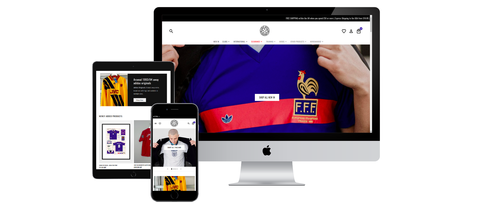

# Cultkits



> Welcome to Cult Kits ~ the home of vintage football shirts.
We stock thousands of vintage jerseys, along with unique bench, training and outer wear. You’ll find retro football shirts, vintage kits and classic football shirts from teams all over the world. Our website is a destination for football fans to find their favourite kit - from the super-rare vintage to modern day clearance - or just to browse the collection and wallow in some nostalgia. The shirts on our site are not retro reproductions or fakes but instead are rare, original and classic shirts. Our range includes all the big clubs - from Manchester United to Millwall, Barcelona to Birmingham, AC Milan to Arsenal. And there are loads of international classics to tempt you, too, including England, Spain, France, Brazil and Germany. You won’t only find classic football shirts on our site but also training kits, tracksuits and boots. We have a constant supply of vintage shirts so keep an eye on our new arrivals pages to make sure you don’t miss out.


## Built With

- React / Redux
- Stripe
- Styled components 

## Getting Started

**This is an example of how you may give instructions on setting up your project locally.**
**Modify this file to match your project, remove sections that don't apply. For example: delete the testing section if the currect project doesn't require testing.**


To get a local copy up and running follow these simple example steps.

### Setup
```
git clone repo HTTPS or SSH
```
### Install
```
npm install
```
### Usage
```
npm run start
```

## Authors

👤 **Author1**

- GitHub: [@jr-cast](https://github.com/jr-cast)
- Twitter: [@josercastanos](https://twitter.com/josercastanos)
- LinkedIn: [@josercastanos](https://linkedin.com/in/josercastanos)

## 🤝 Contributing

Contributions, issues, and feature requests are welcome!

Feel free to check the [issues page](../../issues/).

## Show your support

Give a ⭐️ if you like this project!

## Acknowledgments

- Hat tip to anyone whose code was used
- Inspiration
- etc

## 📝 License

This project is [MIT](./MIT.md) licensed.
